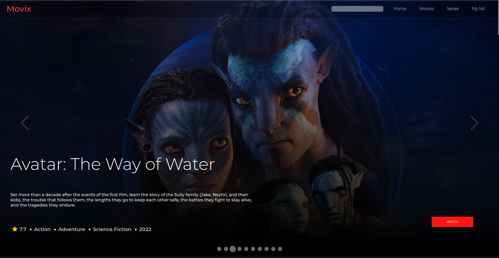
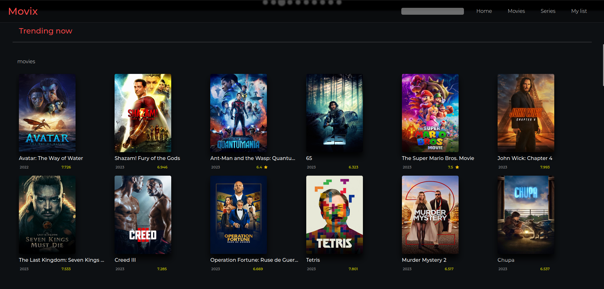
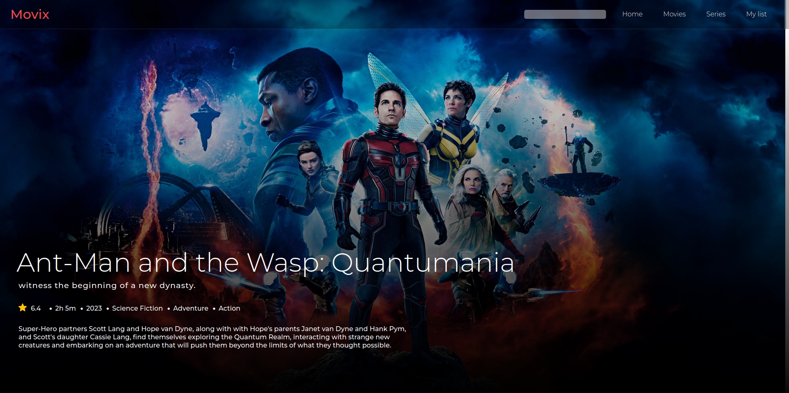

# 

  <h1 align="center">🎥Movie Website 🎥</h1>
  <h3 align="center">Find Your Next Movie</h3>
    

      
      
      
       
      
  

>🎬 A movie website built using React and TMDB API to showcase popular movies, top-rated movies, trending movies, upcoming movies, popular TV series, top-rated TV series, trending TV series, and more.

 
 
 

 
 
 

## Table of Contents 📜

- [Overview](#overview)
- [Installation](#installation)
- [Usage](#usage)
- [Technologies-used](#technologies-used)

## Overview ℹ️

This project is a movie website built using React and the TMDB API. It allows users to browse and explore popular movies, top-rated movies, trending movies, upcoming movies, popular TV series, top-rated TV series, trending TV series, and more. The website provides a visually appealing interface with images, ratings, and other details for each movie or TV series, and allows users to view additional information such as cast, trailers, and reviews.

## Installation 💻

To run the movie website locally, follow these steps:

    Clone the repository to your local machine.
    Navigate to the root folder of the project.
    Install the dependencies using npm install or yarn install.
    Obtain an API key from TMDB by signing up for a free account.
    Create a .env file in the root folder of the project and add your API key using the following format: REACT_APP_TMDB_API_KEY=YOUR_API_KEY.
    Start the development server using npm start or yarn start.

## Usage ▶️

Once the movie website is up and running, you can use it to browse and explore popular movies, top-rated movies, trending movies, upcoming movies, popular TV series, top-rated TV series, and trending TV series. You can also search for movies or TV series by title using the search functionality.Describe how to use the movie website, including any features or functionalities.

## Technologies-used
The movie website is built using the following technologies:

    React: A popular JavaScript library for building user interfaces.
    TMDB API: The Movie Database API for fetching movie and TV series data.
    HTML: The standard markup language for creating web pages.
    CSS: The styling language for designing web pages.
    JavaScript: A popular programming language for building dynamic web applications.